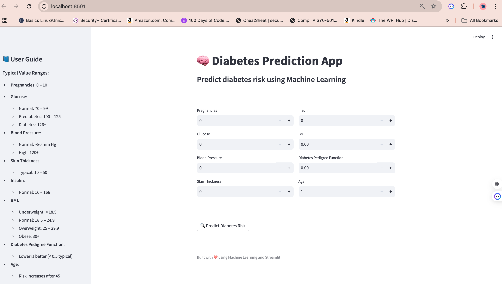

# 🧠 Diabetes Prediction with Machine Learning

An end-to-end machine learning project that predicts diabetes risk using patient health data.  
This project combines data analysis, model comparison, and deployment into a real-world interactive application.

---

##  Live Demo

🔗 https://ml-prediction-models-uwmeoykjhkalwbirlclzns.streamlit.app

---

## App Preview



---

##  Overview

Early detection of diabetes is crucial for preventing long-term health complications.  
This project builds and compares multiple models to predict diabetes risk based on medical attributes.

The project focuses on:
- Data cleaning and preprocessing  
- Feature engineering  
- Model comparison (ML and deep learning)  
- Deployment as a real-time web application  

---

##  Dataset (Database Used)

This project uses the **Pima Indians Diabetes Dataset**, a well-known dataset for medical classification tasks.

- 📍 Source: Kaggle  
- 🔗 https://www.kaggle.com/datasets/uciml/pima-indians-diabetes-database  

### Features:
- Pregnancies  
- Glucose  
- Blood Pressure  
- Skin Thickness  
- Insulin  
- BMI  
- Diabetes Pedigree Function  
- Age  

### Target:
- `Outcome`
  - 0 → No Diabetes  
  - 1 → Diabetes  

---

##  Tech Stack

- Python  
- Scikit-learn  
- TensorFlow / Keras  
- Pandas / NumPy  
- Matplotlib / Seaborn  
- Streamlit  

---

## Models Implemented

### 🔹 Machine Learning Models
- Logistic Regression  
- Random Forest ✅ *(Best Performing Model)*  
- Gradient Boosting  
- K-Nearest Neighbors (KNN)  

### 🔹 Deep Learning Models
- MLP  
- Deep Neural Network (DNN)  

---

##  Results & Key Insights

- ✅ Random Forest achieved the best performance, especially in recall  
- ✅ Deep learning models performed well but did not outperform tree-based models  
- ❌ KNN showed lower performance on this dataset  

###  Key Insight:
> Traditional machine learning models often outperform deep learning models on structured (tabular) datasets.

---

##  Evaluation Metrics

- Accuracy  
- Precision  
- **Recall ✅ (prioritized)**  
- F1 Score  
- ROC-AUC  

👉 Recall is prioritized because correctly identifying diabetes cases is critical in healthcare.

---

## Interactive Web App

A Streamlit web application was built to provide real-time diabetes prediction.

### Features:
- User-friendly input interface  
- Instant prediction results  
- Probability score  
- Visual risk indicator  
- Built-in medical reference guide  

---

## ▶️ Run Locally

```bash
git clone https://github.com/YOUR_USERNAME/ML-Prediction-Models.git
cd ML-Prediction-Models

pip install -r requirements.txt
streamlit run app.py
